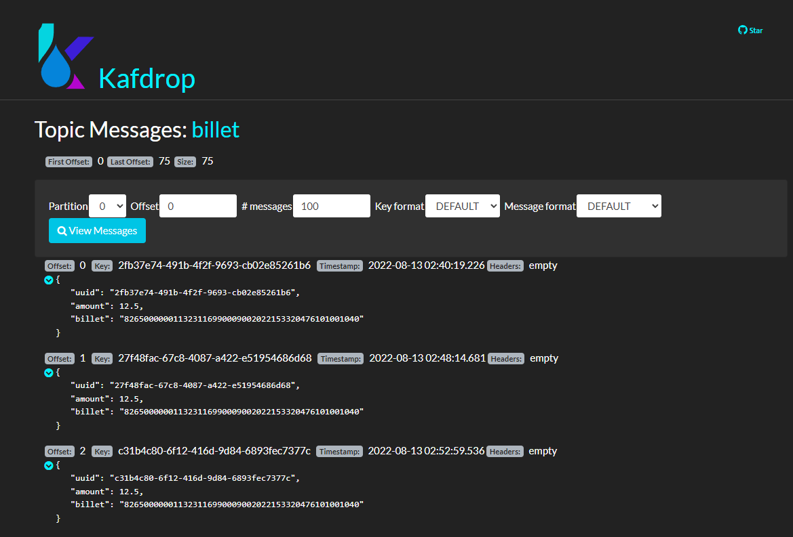

# Desafio Will Bank

A solução encontrada é exemplificada no seguinte fluxo abaixo:


## Elementos

- Api Billet:
    - Desenvolvida em NodeJs + express, responsável por receber as requisições POST /billet para executar um pagamento de boleto e também GET /billet/{uuid} para recuperar informações sobre um boleto
- Cluster kafka:
    - Container docker usado como cluster para conter os brokers que receberam as mensagens dos producers e posteriormente guardadas em disco.
- Payment-provider:
    - Container docker rodando uma imagem nodeJs que contem o consumer, resposável por receber as mensagens publicadas no tópico billet e fazer as requisições para o serviço que realiza o pagamento de boleto.
- Payment-service:
    - Mock responsável por simular a resposta do pagamento de um boleto.
- BILLET-DB
    - Banco de dados responsável por armazenar as informações referentes ao pagamento dos boletos.

## Instalação

Instalação dos pacotes da api:

```bash
  npm install
```

Subindo a infra para o funcionamento da api:

```bash
  npm run infra:up
```
Rodando a api:

```bash
  npm run dev
```

Executando testes:

```bash
  npm run test
```
## Visualizando mensagens

Com o Kafdrop é possivel visualizar as mensagens enviadas pela api, basta acessar **localhost:19000** e selecionar o topic *billet*, segue abaixo como fica a visualização:


## Documentação da api

* A api conta com a documentação dos endpoint feita com swagger, na qual pode ser consultada acessando **localhost:4000/doc/**
* Para facilitar o consumo da API foi feito exportada uma collection que pode ser consumida via postman, ela se encontra na pasta **./docs**

## Environments

Para a conexão com banco de dados é necessário a criação de um arquivo .env na raiz do projeto com as seguintes informações:

- DB_HOST=localhost
- DB_USER=admin
- DB_PASSWORD=123
- DB_PORT=27017
- DB_NAME=BILLET_DB
- COLLECTION=billets
- KAFKA_CLIENT=my-app-billet
- KAFKA_TOPIC=billet
- KAFKA_BROKERS=["localhost:9092"]

